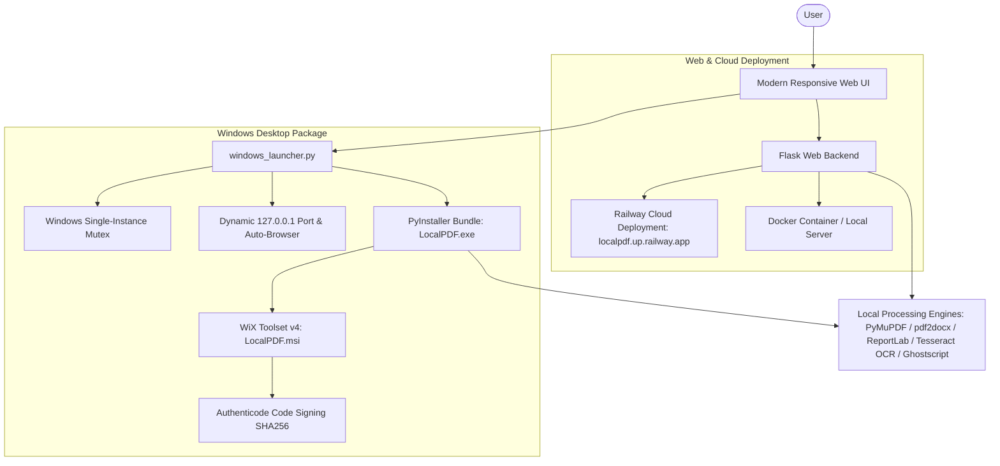

<div align="right">

🌐 **Language** | **English** · [Português 🇧🇷](README.pt-br.md)

</div>

<div align="center">

# 🌟 LocalPDF.io

[](https://opensource.org/licenses/MIT)
[](https://www.python.org/)
[](https://flask.palletsprojects.com/)
[](https://www.docker.com/)
[](https://localpdf.up.railway.app/)
[](https://github.com/JoadsonRocha/localpdf.io/releases/download/1.0.0/LocalPDF.msi)
[](CONTRIBUTING.md)
[](#-contributors)

<br>

<a href="https://github.com/JoadsonRocha/localpdf.io/releases/download/1.0.0/LocalPDF.msi">
  
</a>

<br><br>

> Every PDF tool you need — 100% local, 100% private, zero cloud tracking.

**💻 [Download Windows Installer (MSI)](https://github.com/JoadsonRocha/localpdf.io/releases/download/1.0.0/LocalPDF.msi)** • **🚀 [Try Live Web Demo on Railway](https://localpdf.up.railway.app/)** • **🌐 [Official Project Website](https://virgiliojr94.github.io/localpdf.io/)**

[Download](#-windows-desktop--official-installer) •
[Features](#-features) •
[Architecture](#-architecture) •
[Usage](#-usage) •
[Roadmap](ROADMAP.md) •
[Contributing](CONTRIBUTING.md) •
[License](#-license)

</div>

---

## 📋 What is it?

LocalPDF.io is a modern application for PDF and document manipulation. Every file is processed directly on your computer — nothing is sent to the cloud.

No accounts. No subscriptions. No artificial page limits. Complete document privacy.

---

## ✨ Features & UX

All operations run locally with full hardware performance and a 100 MB configurable file limit.

### 📥 Convert to PDF
- **🖼️ Images → PDF** - Combine multiple JPG and PNG images into a single PDF
- **📝 Word → PDF** - Convert one or more DOCX documents into PDF
- **📊 Excel → PDF** - Convert XLSX spreadsheets into formatted PDF tables
- **📄 Text → PDF** - Convert plain TXT files into clean PDF pages

### 📤 Convert from PDF
- **🖼️ PDF → JPG** - Convert PDF pages into compressed JPG images
- **🖼️ PDF → PNG** - Convert PDF pages into high-definition PNG images
- **🖼️ PDF → Images** - Extract every PDF page into separate image files
- **📊 PDF → Excel** - Extract tables from PDF directly into editable Excel (.xlsx) spreadsheets (powered by `pdfplumber`)
- **📝 PDF → Word** - Convert PDF files into fully editable Word (.docx) documents (powered by `pdf2docx`)
- **📄 PDF → Text** - Extract selectable text into plain TXT files
- **🔒 PDF → PDF/A** - Standardize documents to the archival PDF/A-1b standard (via Ghostscript)
- **🔍 OCR PDF** - Optical Character Recognition for scanned PDFs and images using local Tesseract OCR

### 🔄 Organize, Edit and Secure PDF
- **🔗 Merge PDFs** - Combine multiple PDF files in any order
- **✂️ Split PDF** - Extract all pages or specific page intervals (e.g. `1-3, 5, 8-10`)
- **📦 Compress PDF** - Optimize images and reduce file size while preserving readability
- **🔐 Protect PDF** - Encrypt PDF documents with AES-256 local passwords
- **🔓 Unlock PDF** - Permanently remove password protection from protected PDF documents
- **💧 Professional Watermark** - Apply subtle, 45° diagonal semi-transparent watermarks (or header/footer) with custom color and opacity controls
- **🔢 Page numbers** - Add custom page numbering to headers or footers
- **🖥️ Visual PDF Page Editor** - Interactive canvas to reorder by drag-and-drop, insert pages from external PDFs/images, rotate, duplicate, add blank pages and delete pages

### 💎 Modern User Interface & Flow
- **🎨 Custom SVG Icons**: Dedicated vector icon for every tool instead of generic emojis.
- **🏷️ Real-time Category Tabs**: Instant filtering by *All*, *Organize PDF*, *Convert PDF*, *Optimize PDF*, and *OCR*.
- **📑 Separate Tab Navigation**: Dedicated routes (`/tool/<tool_name>`, `/editor`, and `/about`) that open in separate tabs with synchronized browser titles.
- **⚡ Dynamic Loading & Stage Feedback**: Animated progress bar (`progressShimmer`), real-time contextual stage messages (e.g. OCR text recognition, image compression), and elapsed timer (`⏱️ 00:03`).
- **📁 File Management**: File extension badges, human-readable file sizes (`KB` / `MB`), and individual removal buttons (`✕ Remove`).
- **📥 One-Click Re-Download**: Result card retains downloaded files in memory, allowing instant re-download without reprocessing.
- **🏷️ Standardized File Renaming**: Generated files strictly retain your original document's base name (e.g. `report_compressed.pdf`, `contract_merged.pdf`, `financial.xlsx`, `document_ocr.txt`).
- **ℹ️ Dedicated About Page**: Built-in `/about` page detailing zero-cloud architecture, comparative benchmarks against online services, and open source documentation.
- **🌐 Full Bilingual Support**: Toggle seamlessly between Portuguese (pt-BR) and English (EN).

---

## 🏗️ Architecture

LocalPDF.io is built around a dual-target architecture: a web service (Docker / Cloud) and a native Windows Desktop application (Portable / MSI).



### 1. Web & Cloud Architecture
- **Backend Framework**: Python 3.11+ with Flask and Waitress WSGI.
- **Processing Core**: PyMuPDF (MuPDF C++ bindings) for high-speed PDF rendering, pdf2docx, Pillow, ReportLab, and openpyxl.
- **Cloud Demo**: Deployed on Railway at [https://localpdf.up.railway.app/](https://localpdf.up.railway.app/).
- **Containerization**: Official Docker image available on GitHub Container Registry.

### 2. Windows Desktop Architecture
- **Portable Executable**: Standalone bundle compiled with PyInstaller (`dist/LocalPDF/LocalPDF.exe`).
- **MSI Installer**: Enterprise-grade Windows Installer package generated with WiX Toolset v4 (`dist/LocalPDF.msi`) for per-machine installation in `Program Files`.
- **Local Isolation & Security**:
  - Automatically binds strictly to `127.0.0.1` on a dynamically allocated free port.
  - Automatically launches the default Windows browser.
  - Protected by a Windows Mutex (`CreateMutexW`) to prevent duplicate or zombie processes.
  - Temporary processing files reside in `%TEMP%` — never writing to restricted directories like `C:\Program Files`.
- **Authenticode Code Signing**:
  - Scripts provided in `packaging/windows/` for signing binaries and installers with SHA256 and RFC 3161 timestamps (DigiCert).
  - `install-cert.ps1` allows one-click local trust configuration to prevent Windows SmartScreen unknown root warnings.

---

## 💻 Windows Desktop & Official Installer

Get the official, digitally signed Windows installer:

<div align="center">
  <br>
  <a href="https://github.com/JoadsonRocha/localpdf.io/releases/download/1.0.0/LocalPDF.msi">
    
  </a>
  <p><em>Compatible with Windows 10 & 11 (64-bit) • ~99 MB • Authenticode Signed • Start Menu & Desktop Shortcuts</em></p>
  <br>
</div>

- **Native System Installation:** Installs into `C:\Program Files\LocalPDF.io` with clean uninstall support.
- **Offline & Private:** Processed strictly on `127.0.0.1` — your files never leave your machine.
- **Single Instance:** Automatically launches in your default web browser without creating redundant background processes.

> 💡 **Developers**: See [packaging/windows/README.md](packaging/windows/README.md) for full instructions on building the package, compiling the WiX MSI installer, and signing releases with Authenticode.

---

## 🚀 Usage

### 1. Online Demo (Instant Access)
Try all features directly in your browser:
👉 **[https://localpdf.up.railway.app/](https://localpdf.up.railway.app/)**

### 2. Docker (Fastest Self-Hosted)
Run directly from the GitHub Container Registry:

```bash
docker run -p 5000:5000 ghcr.io/virgiliojr94/localpdf.io:latest
```

Open: **http://localhost:5000**

### 3. Run from Source

```bash
# Clone the repository
git clone https://github.com/virgiliojr94/localpdf.io.git
cd localpdf.io

# Setup Python virtual environment
python -m venv .venv
.\.venv\Scripts\activate

# Install dependencies
pip install -r requirements.txt

# Run server
python app.py
```

Open: **http://localhost:5000**

---

## 🛠️ Tech Stack

- **Flask** - Python web application framework
- **PyMuPDF (Fitz)** - High performance PDF engine
- **Pillow (PIL)** - Image manipulation and rasterization
- **pdf2docx** - PDF to Word conversion engine
- **python-docx** - Word document reading and structuring
- **ReportLab** - Dynamic PDF document generation
- **OpenPyXL** - Excel spreadsheet parser
- **Tesseract OCR** - Optical Character Recognition engine
- **Ghostscript** - PDF/A conversion and rendering
- **WiX Toolset v4** - Windows Installer XML (MSI) build system
- **PyInstaller** - Standalone Windows executable packager

---

## 🔒 Privacy & Security

All document processing occurs strictly **on your local machine** when using the desktop application or self-hosted Docker. No document content, metadata, or telemetry is ever transmitted to external servers.

---

## 🤝 Contributing

Contributions are welcome! Please check out the [contribution guide](CONTRIBUTING.md) to get started.

---

## 👥 Contributors

Thank you to everyone who has contributed to LocalPDF.io! ✨

<a href="https://github.com/virgiliojr94/localpdf.io/graphs/contributors">
  
</a>

---

## 📝 License

Distributed under the MIT License. See `LICENSE` for more information.
